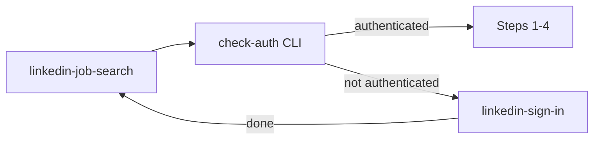

# Project skills menu

Invoke a skill by name (e.g. `/browser-manager`, `@linkedin-job-search`). Each skill lives in `.cursor/skills/<name>/SKILL.md`.

## Available skills

| Skill | Path | Use when |
|-------|------|----------|
| **browser-manager** | [browser-manager/SKILL.md](browser-manager/SKILL.md) | Generic Playwright automation: navigate, scrape, JS, screenshots, feed JSON. Headless/CI/production (not `cursor-ide-browser`). |
| **linkedin-sign-in** | [linkedin-sign-in/SKILL.md](linkedin-sign-in/SKILL.md) | Manual LinkedIn login only. Ends when `check-auth` succeeds. Does **not** start job search. |
| **linkedin-feed-collect** | [linkedin-feed-collect/SKILL.md](linkedin-feed-collect/SKILL.md) | Collect hiring-announcement posts from the LinkedIn feed → structured JSON (company, job, author, post URLs). Uses `hiring-posts` op. |
| **linkedin-job-search** | [linkedin-job-search/SKILL.md](linkedin-job-search/SKILL.md) | Hiring feed scrape → filter → `.export/linkedin_posts_*.json`. **Step 0** calls sign-in if needed. |

### Orchestration (LinkedIn)



- **linkedin-sign-in** never auto-starts **linkedin-job-search**.
- **linkedin-job-search** Step 0 may invoke **linkedin-sign-in**, then re-run `check-auth`.

### One-shot alternative (no skill steps)

```bash
poetry run python -m src.utility.browser
```

Runs `LinkedInWebAgent` (LangChain + built-in auth) — not the skill-driven CLI path.

---

## Shared CLI entry

All browser-related skills use the same wrapper:

```bash
poetry run python scripts/browser_manager.py [GLOBAL_FLAGS] COMMAND ...
# equivalent:
poetry run python -m src.utility.browser_manager [GLOBAL_FLAGS] COMMAND ...
```

**One-time setup:** `poetry run playwright install chromium`

**Session rule:** Each subcommand (`navigate`, `title`, `js`, …) opens and closes its own browser. Chain dependent actions with `run --steps` (`session_mode: multi_step`). See **linkedin-job-search** skill.

### Global flags (`BrowserManager`)

| Flag | Purpose |
|------|---------|
| `--headless` / `--no-headless` | Headless vs visible window (default: headless) |
| `--viewport WxH` | Viewport, default `1280x720` |
| `--user-agent STRING` | Custom User-Agent |
| `--user-data-dir PATH` | Persistent Chrome profile (e.g. `.browser_profile`) |
| `--profile-directory NAME` | Profile name (e.g. `Default`) |

**LinkedIn profile alias** (copy into skill runs):

```bash
BM="poetry run python scripts/browser_manager.py \
  --user-data-dir .browser_profile --profile-directory Default --no-headless"
```

### Commands by skill

| Command | browser-manager | linkedin-sign-in | linkedin-job-search |
|---------|:-----------------:|:----------------:|:-------------------:|
| `check-auth` | ✓ | ✓ (verify) | ✓ (Step 0) |
| `sign-in [--timeout-s N]` | ✓ | ✓ (main) | — (use sign-in skill) |
| `navigate URL` | ✓ | — | only inside `run --steps` |
| `js` / `js --file PATH` | ✓ | — | only inside `run --steps` |
| `feed-posts [--max-posts N] [--scroll-rounds N]` | ✓ | — | only inside `run --steps` |
| `run --steps JSON` | ✓ | — | **required** for Steps 1–2 |
| `url`, `title`, `text`, `html` | ✓ | — | debug |
| `screenshot`, `scroll`, `wait` | ✓ | — | debug |

Full command reference: [browser-manager/SKILL.md](browser-manager/SKILL.md).

### `run --steps` ops

`navigate`, `url`, `title`, `text`, `html`, `js`, `screenshot`, `scroll`, `wait`, `feed-posts`, `check-auth`, `sign-in`

### JSON stdout

- **Success (stdout):** `{"ok": true, "command": "...", "browser": {...}, "data": {...}}`
- **Failure (stderr, exit ≠ 0):** `{"ok": false, "command": "...", "error": "..."}`

Auth errors for orchestration:

| `error` | `action` / next step |
|---------|----------------------|
| `linkedin_not_authenticated` | `invoke_skill:linkedin-sign-in` |
| `linkedin_sign_in_timeout` | Retry sign-in or abort job-search |

---

## Adding skills

New skills: `.cursor/skills/<skill-name>/SKILL.md` with YAML `name` and `description`. Update this file’s tables when you add one.
